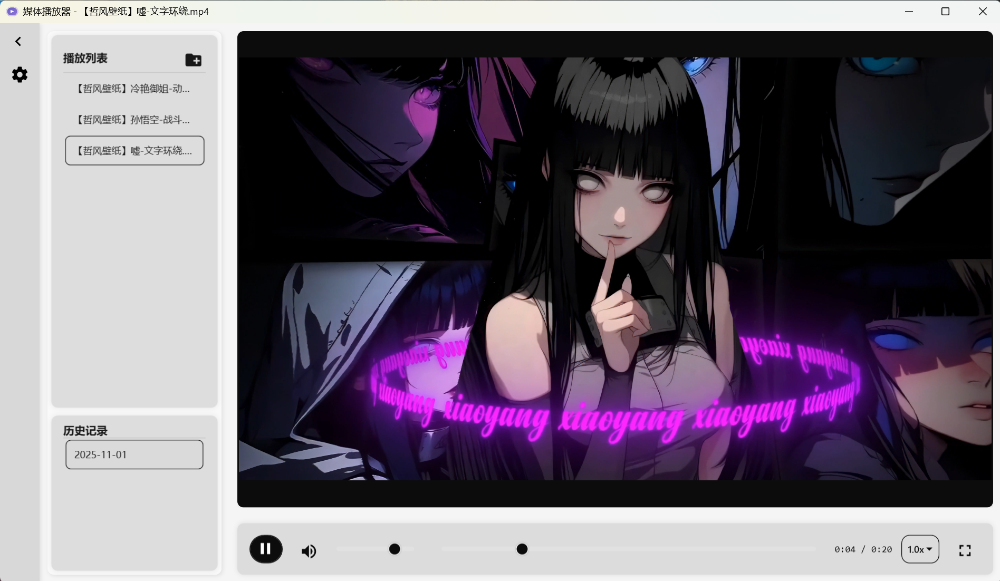
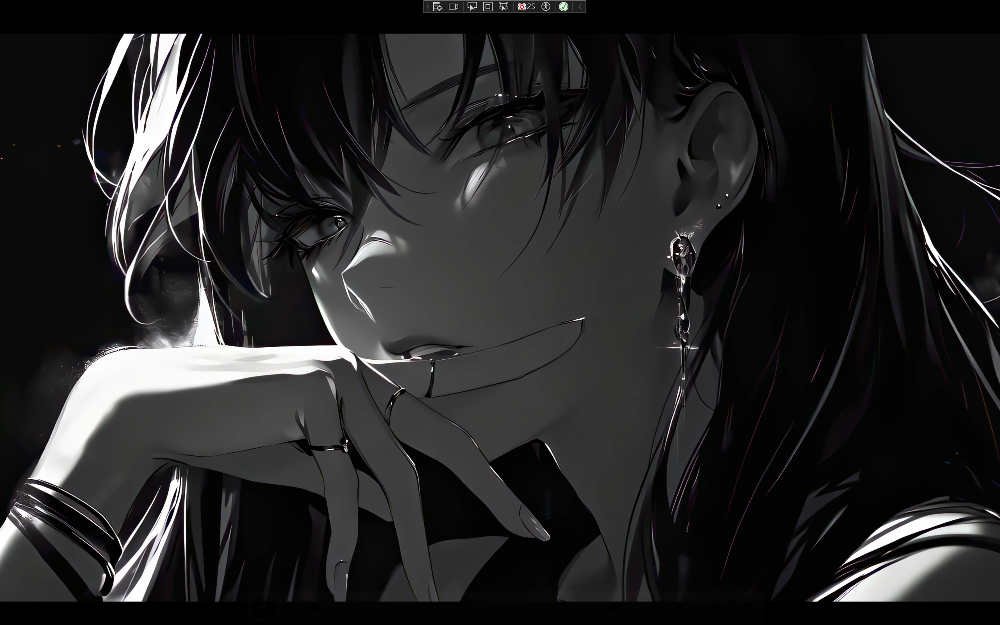
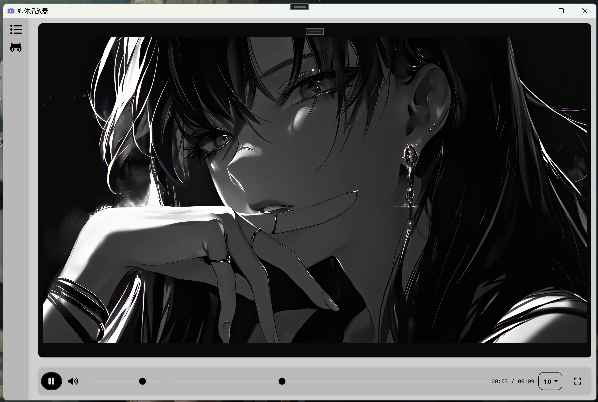
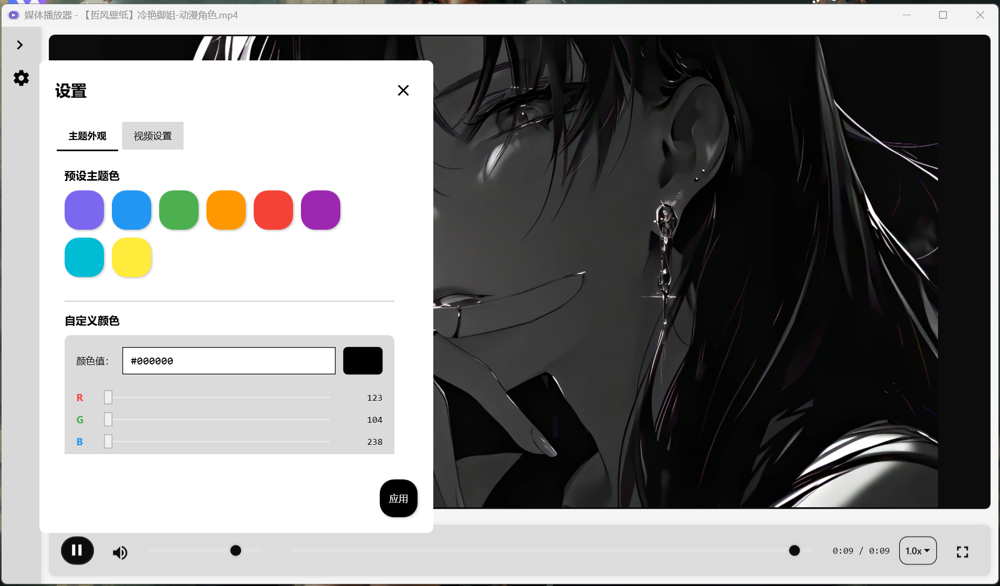

# 媒体播放器项目说明

## 项目简介

这是一个基于WPF+VLC开发的媒体播放器应用程序，支持视频文件播放，具有现代化的用户界面和丰富的功能特性。

## 主要功能

- **媒体播放**：支持常见视频格式（MP4、AVI、MKV、WMV等）
- **播放控制**：播放/暂停、音量调节、进度控制
- **全屏功能**：支持进入/退出全屏模式，ESC键快速退出全屏
- **播放列表**：可从文件夹加载媒体文件列表
- **历史记录**：自动保存播放历史，按日期分类显示
- **主题切换**：支持多种预定义主题色和调色盘
- **键盘快捷键**：提供常用功能的快捷键操作，包括ESC键退出全屏 
- **侧边栏**：可折叠/展开的侧边栏，显示历史记录和播放列表


## 项目结构

```
Player/
├── App.xaml          # 应用程序入口
├── MainWindow.xaml   # 主窗口
├── Left/             # 左侧控件（历史记录和播放列表）
│   ├── LeftControl.xaml
│   ├── LeftControl.xaml.cs
│   └── SettingsDialog.xaml
├── Middle/           # 中间控件（视频播放区域）
│   ├── MiddleControl.xaml
│   └── MiddleControl.xaml.cs
├── Bottom/           # 底部控件（播放控制条）
│   ├── BottomControl.xaml
│   └── BottomControl.xaml.cs
├── ViewModel/        # 数据模型
│   └── PlayerViewModel.cs
├── Helpers/          # 辅助类
│   ├── ConfigManager.cs
│   ├── ThemeManager.cs
│   └── VisualTreeHelperExtensions.cs
└── JSON/             # 配置文件目录
    ├── history.json
    └── theme.json
```

## 技术特点

1. **MVVM架构**：采用Model-View-ViewModel设计模式
2. **响应式UI**：基于WPF的数据绑定机制实现界面响应
3. **事件驱动**：使用事件机制实现组件间通信
4. **配置持久化**：使用JSON文件保存用户配置和历史记录
5. **错误处理**：完善的异常处理和日志记录机制
6. **代码优化**：优化代码结构，解决高耦合低内聚问题，提升代码可维护性
7. **资源管理**：完善的资源释放机制，避免内存泄漏
8. **接口实现**：实现IDisposable接口，确保资源正确清理
9. **结构重构**：提取辅助方法，简化主流程，提高代码可读性

## 关键组件说明

### PlayerViewModel
- 管理播放状态（播放/暂停）、进度、音量等
- 处理文件选择和文件夹扫描功能
- 维护播放列表和历史记录
- 提供命令绑定功能

### LeftControl
- 显示历史记录日期列表
- 展示对应日期的媒体文件列表
- 实现侧边栏折叠/展开功能
- 提供设置入口

### MiddleControl
- 负责媒体播放核心功能
- 处理全屏模式切换和视频渲染
- 实现高效的视频播放控制和状态管理
- 优化的资源释放机制，防止内存泄漏
- 平滑的尺寸变化和过渡效果处理

### BottomControl
- 提供播放控制栏
- 实现进度条、音量控制等交互功能

## 键盘快捷键

- **空格键**：播放/暂停
- **Ctrl+O**：打开媒体文件
- **Ctrl+F**：切换全屏
- **ESC**：退出全屏模式
- **Ctrl+B**：折叠/展开侧边栏

## 功能改进日志

### 最新更新
- 2025-10-31 :优化全屏模式下控制栏交互体验，改进显示/隐藏逻辑
- 2025-10-31 :实现ESC键快速退出全屏功能
- 2025-10-31 :优化控制栏透明度设置，提升用户体验
- 2025-10-31 :完善事件订阅管理，避免内存泄漏 
- 2025-11-01 :建立统一的播放状态管理，防止icon与视频播放状态不符；
- 2025-11-01 :优化进度条平移的平滑度。
### 已知问题：
  1. 当视频播放结束后拖动进度条无法重播;
  2. 全屏状态下快速点击 播放/暂停 或者多次拖动进度条，会出画面撕裂卡顿


## 应用截图

以下是播放器的主要界面截图：

### 初始状态


### 全屏悬浮控制栏


### 控制栏隐藏状态


### 文件列表折叠


### 视频选项


### 调色盘


## 系统要求

- Windows系统
- .NET 8.0运行时
- VLC媒体播放器核心组件（libvlc）

## 开源协议

本项目基于 GNU Lesser General Public License v2.1 or later (LGPL-2.1-or-later) 许可。

## 第三方库致谢

本项目使用了多个开源库，详细信息请参阅 [THIRD-PARTY-NOTICES.txt](THIRD-PARTY-NOTICES.txt) 文件。

在此，我们向所有开源作者表示诚挚的感谢和敬意！

## 开发环境

- Visual Studio 2022+
- Visual Studio Code
- .NET 8.0 SDK
- WPF开发工具包
- VLC媒体播放器开发库